# 转换原版Ballance的nmo关卡

## 准备

* Unity 2021.2.1 以上版本
* Virtools （3.5 或者 5.0 都可以）
* 3dsmax 或者 blender
* 克隆本项目 https://github.com/imengyu/Ballance 至您的本地，使用Unity打开

## 步骤

### 导出

1. 选择 Virtools 打开你的关卡文件 （3.5 或者 5.0 都可以）。
2. 为你的 Virtools 安装 @yyc12345 的 [vtobjplugin](https://github.com/yyc12345/vtobjplugin) 插件。
3. 导入你的关卡 nmo 文件到 Virtools 中。

    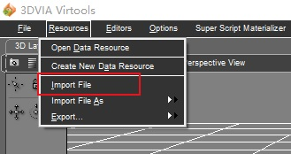

4. 请将所有文件放在一个组中，名字可以随意。

    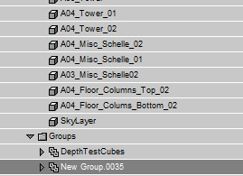

5. 点击菜单中的 Vtobj > Export object

    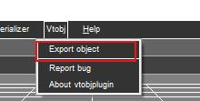

6. 选择刚刚新建的组。你可以选择生成一个 3ds 脚本，方便稍后定位物体。请勾选导出材质。

    

7. 可以看到导出了3个文件。

    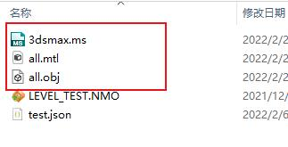

8. 可以打开3DSMax，选择导入，导入刚刚生成的obj文件，配置如下：

    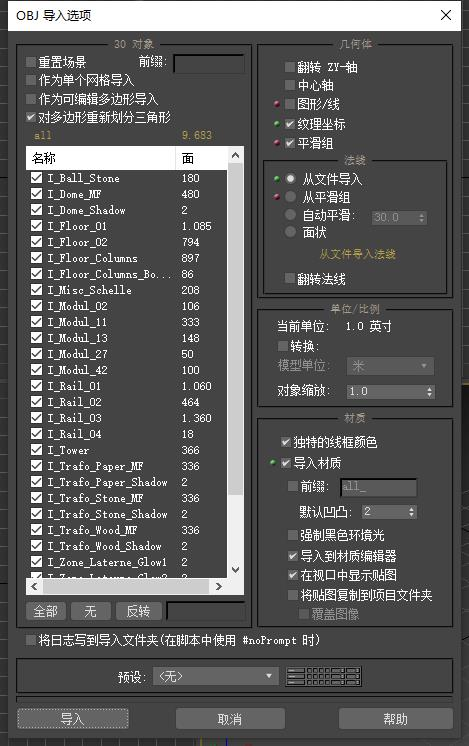

9. 导入后可以将刚刚生成的定位脚本文件拖入3DSMax，这样物体的坐标就自动定位好了。

    
    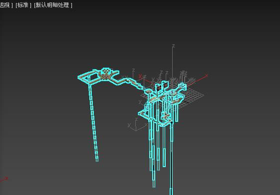

10. 然后就可以导出FBX文件了，在3DSMax菜单中选择导出，导出FBX文件，配置可以默认，但需要勾选“嵌入的媒体”选项。

    

### 导入 Unity

1. 然后回到Unity项目中，点击菜单“Ballance”>“关卡制作”>“创建关卡模板”，在名称中可以输入您关卡的名称（英文），可以加上自己的名字以防止与其他人冲突，例如“imengyu-mylevel”，不要用原版关卡的名字例如“level01”。

    

2. 选之后会在项目的 `Assets/Level` 目录中生成一个关卡文件，这就是您的关卡了，以后都需要在这里对关卡进行修改，打包。

    这里有三个文件，功能分别是：
    * Level.json  关卡描述信息，归组信息，配置信息。
    * Level.prefb 关卡模型。
    * Level.png   关卡Logo，显示在信息和关卡管理器中。

    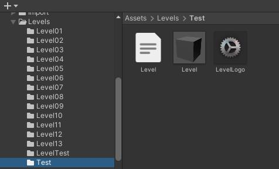

3. 将刚刚生成的FBX导入Unity，为了整齐，你可以把你的文件FBX导入至 `Assets/Import/Levels` 目录中, 可以直接把fbx文件拖动进来。

    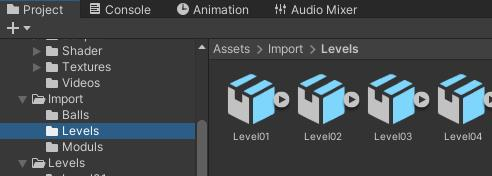

4. 导入后请点击刚刚导入的项目，修改下导入设置。
    * 需要设置 “Scale Factor” 为 `1` 。
    * 需要取消勾选 “Convert Units”。

    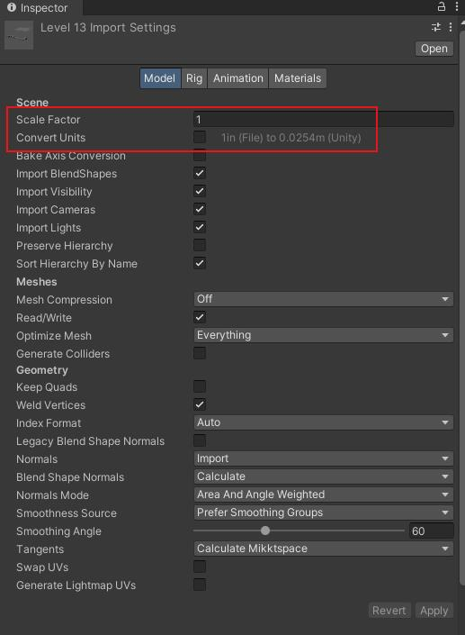

5. 然后选择 Materials 页面，在 “On Demand Remap” 中，修改材质重定向。
    * Nameing 设置为 “Form Models Material” 。
    * Search 设置为 “Project-Wide” 。
    * 然后点击 “Search and Remap” 让 Unity 自动搜索并重定向材质。

    你也可以不设置重定向不使用游戏材质，这样使用的就是Fbx自带的材质，材质会自动打包到关卡包中，这个无须担心。
    但是可能运行起来你就会发现材质与原版略有不同，游戏内的材质是经过精细调整的，您自己导入的材质则没有调整，可能需要您自己修改下才能达到比较好看的效果。

    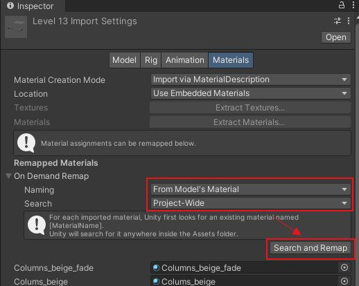

6. 这以后，您关卡中的材质就自动重定向至游戏内的材质了，打包的时候还可以减少重复材质造成的体积浪费。

    可能有些材质是游戏内没有的，如果不是重要的材质，你可以将其设置为 Unity 的Default材质（这个材质没有用的情况下，可以减少体积），或者是不设置，使用fbx带的材质。

    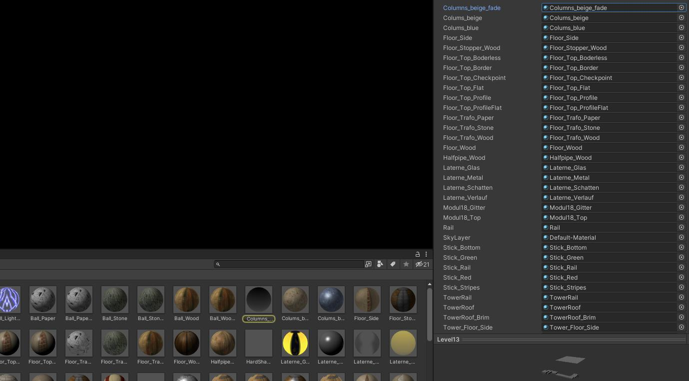

7. 到这里您的关卡文件已经成功导入至 Unity 了。

### 关卡制作

1. 回到之前项目中生成的关卡文件夹中，双击打开 “Level.prefab” 。

    * 现在，在 Import/Level 中选择之前导入的fbx，将其拖动进入 Level 下。

    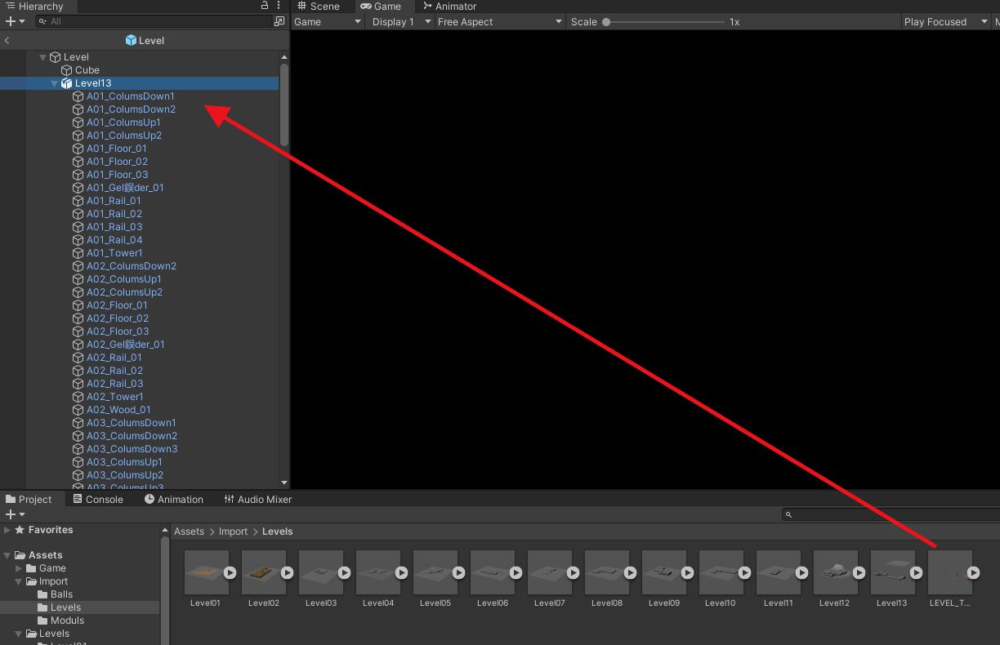

    * 右键选择 “Prefab” > “Unpack”, 这样可以解构，方便后续修改。

    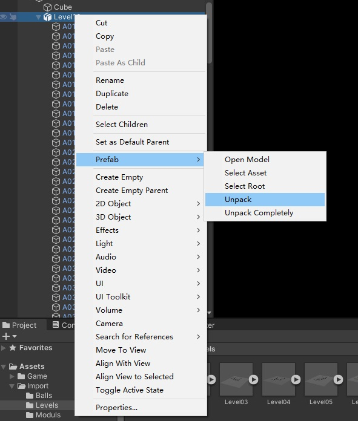

    * 为了方便和整齐，可以把解构后的子级物体移动到顶层，然后删除多余的 “Cube” 和空物体。

    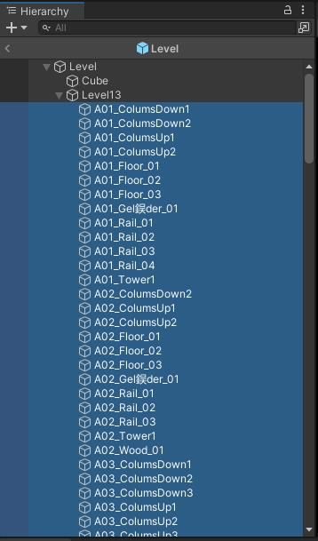
    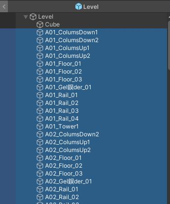

    * virtools中导出的物体可能会存在乱码问题，可能需要您自己修改下。

    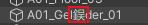

2. 重新定位机关占位符。

    * 从 Virtools 中导出的机关占位符，他们的旋转存在一些问题，需要您手动修改下

    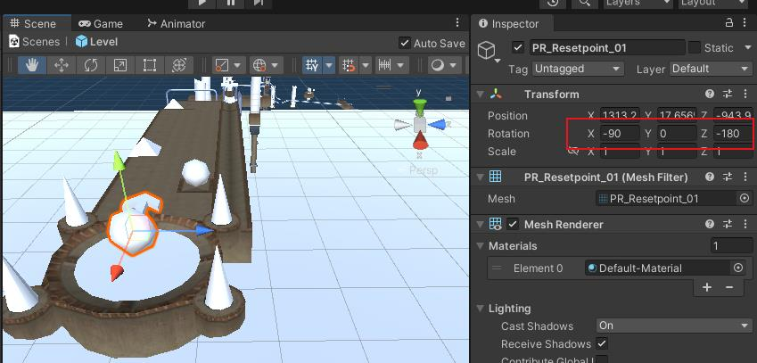

    * 你需要使用游戏内置的占位符组件，替换从 Virtools 中导出的占位符。具体方法是：

      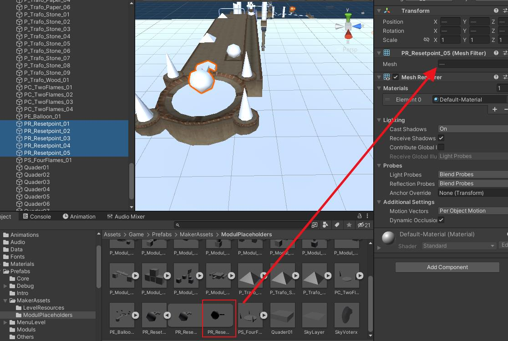

      * 在 `Assets/Game/Prefabs/MakerAssets/ModulPlaceholders` 文件夹下存放的就是官方占位符组件，旋转是正常的。
      * 你需要将自己导入的关卡中的机关占位符Mesh替换为ModulPlaceholders下的Mesh。
      * 以 PR_Resetpoint 为例，你可以选择所有 PR_Resetpoint_
      * 在 ModulPlaceholders 下找到 PR_Resetpoint_01 下的 Mesh
      * 将其拖动至右边物体的 Mesh filter 组件中的 Mesh 属性中。

      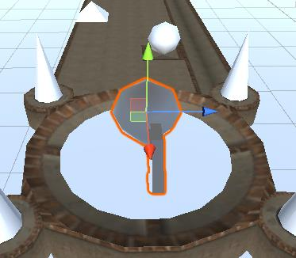

      * 替换后物体的旋转存在问题，需要您手动修改下，以让他转到准确的方向。

      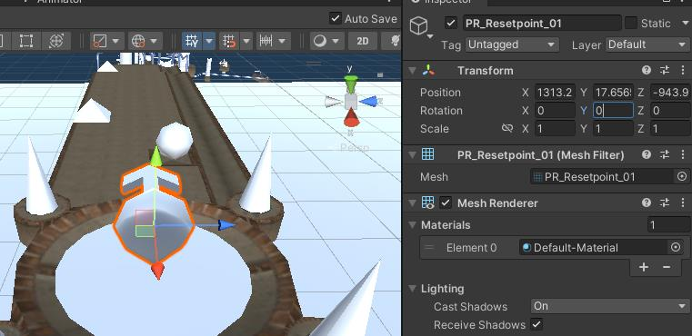

3. 归组信息。Ballance 关卡的归组在原版是以 “组” 的形式保存的，而在重制版中信息是以 json 文件保存。

    重制版当然提供了方便的方法让您快速导入nmo中的归组信息，不需要您手动写（不然要累坏了），方法如下：

    * 在 Virtools 中打开您的的nmo关卡，在Level Scripts 下添加一个脚本：

    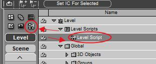

    * 把 `项目目录/Tools/Virtools/Ballace原版归组转换脚本.nms` 拖入脚本中，连接左边的箭头。

    

    * 然后双击打开，修改下 “SavePath” ，改成您保存的路径。

    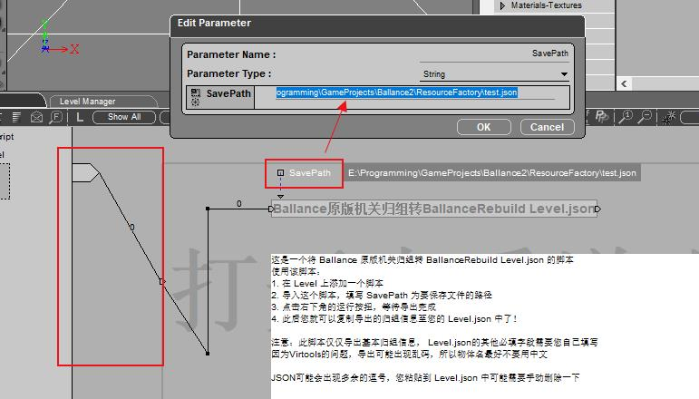

    * 然后点击右下角播放按扭，稍等一下。

    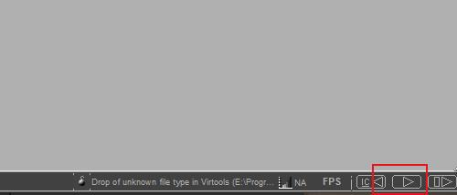

    * 等有咚的一下响，输出 Done！的时候，就可以关闭 Virtools 了。

    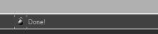

    * 在刚刚您设置的输出路径找到刚刚输出的 JSON 文件。

    

    * 使用编辑器打开 JSON 文件（这里用的是 VSCode），可以先格式化下，方便查看

    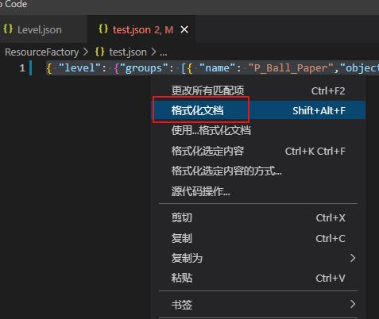

    * 请选择 “Level” 开始，到倒数第二关大括号，复制一下。

    

    * 然后打开您的关卡 Level.json 文件，把刚刚复制的内容粘贴到方框中，保存。

    

    * 这样就成功把归组信息导出到 Level.json 了！
    * 注意：Virtools 中导出字符串可能有乱码，需要手动修改下

    另外，您也可以选择*自动归组*, 这对于新制作的关卡很有帮助，自动归组是另外一种关卡归组方法，不需要您写JSON配置，可以使用对象名称来自动生成归组信息。具体请参考[文档](auto-group.md)。

4. Level.json 配置说明

    请参考 [Level.json 配置说明文档](level-json.md)。

5. 关卡调试

    制作关卡后你可以进行调试，以检查关卡逻辑是否正确，游戏提供了调试方法：

    * 在 Unity 中打开 `Assets/System/Scenes/MainScense.unity` 场景。
    * 选择 GameEntry 物体，在右侧选择 GameEntry ，打开 “全局调试配置”。
    * 设置 Debug Type 为 “Custom Debug”。
    * 然后在下面 Level Name 中填写您的关卡名称（是创建时写的名字）
    * 然后点击顶部的播放按扭，开始运行

    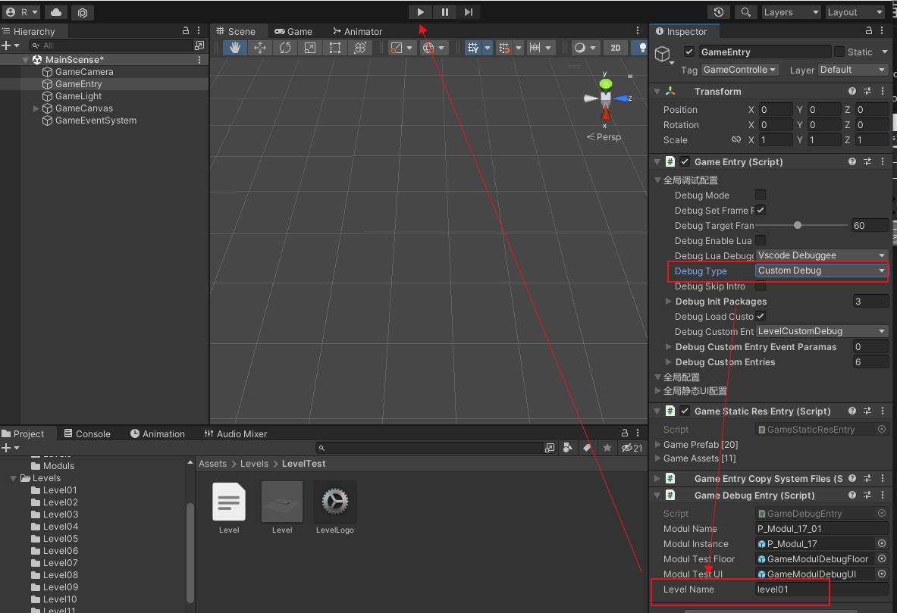

    * 这样游戏会为您创建一个关卡调试环境，你可以在关卡中游玩，方便您进行调试。

6. 关卡打包

    当您调试关卡觉得没问题后，就可以打包了，打包后可以分享给他人，就可以在游戏中加载并游玩您的关卡了，打包的步骤是：

    * 选择主菜单 “Ballance”>“关卡制作”>“打包关卡”

      

    * 选择你的关卡，然后平台选择：
      * 如果是 Win 版本，只需要选择 Standalone Windows 即可。
      * 如果是 android 版本，需要选择 Android。
      * 如果是 ios 版本，需要选择 iOS
    * 可以选择打包至 DebugFolder，文件会输出至 `项目目录/Debug/Levels` 下。

      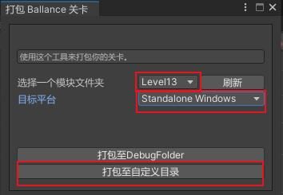

    * 成功后你就可以在输出目录中找到后缀为 ballance 的文件了，这就是您的关卡，你可以把它复制放在 `游戏目录\Ballance_Data\Levels` 文件夹下，打开游戏，在开始中选择 “自定义关卡” 菜单，即可加载自定义关卡。

      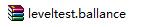
