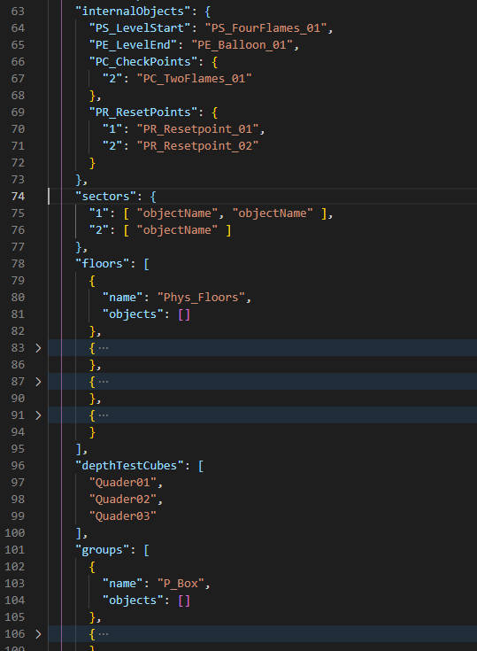

# 新制作关卡

## 准备

* Unity 2021.2.1 以上版本
* 克隆本项目 https://github.com/imengyu/Ballance 至您的本地，使用Unity打开
* 3dsmax 或者 blender

## 步骤

1. 构思。
2. 制作3D文件。
  
    对于地图的3D文件制作，在Ballance吧已有非常多的教程，具体请参考[Ballance Wiki 制图教程章节中的3d部分（不包括有关于Virtools的部分）](https://ballance.jxpxxzj.cn/index.php?title=Ballance%E5%90%A7%E5%AF%BC%E8%88%AA%E8%B4%B4&_c=#.E8.87.AA.E5.88.B6.E5.9C.B0.E5.9B.BE.2F.E5.88.B6.E5.9B.BE.E6.95.99.E7.A8.8B)，本文档一篇也写不下。

    你可用 3dsmax 或者 blender 制作，然后将其导出为 FBX, 并导入 Unity 制作您的关卡。

    Ballance 项目中附带了 BMMaker 和 Trail Maker 工具，如果你制图需要，可以在 `Tools\Ballance制图工具` 目录下找到。

3. 导出FBX

    * 注意，3dsmax 导出时请选择 “” ，否则导入后材质会丢失。
    * blender 导出时可以不导出灯光、摄像机。

4. 导入 Unity

    为了整齐，你可以把你的文件FBX导入至 `Assets/Import/Levels` 目录中, 可以直接把fbx文件拖动进来。

    

    导入后请点击刚刚导入的项目，修改下导入设置。

    * 如果是3dsmax导出的FBX，需要设置 “Scale Factor” 为 `1` 。
    * 如果是blender导出的FBX，需要设置 “Scale Factor” 为 `0.5`（试了好几次感觉0.5刚刚好） 。
    * 需要取消勾选 “Convert Units”。
    * 需要勾选 “Read/Write”。

5. 材质重定向

    材质重定向的目的是，因为有很多关卡，很多关卡的路面其实使用的都是外观基本相同的材质，但是FBX导入的时候其实所有材质都是一个单独的实例。这样每个关卡都有差不多相同的材质实例，非常浪费资源。如果你的关卡使用的路面基本都是原版关卡的样子，你可以重定向 FBX 内的材质变成游戏内置材质。

    你也可以不设置重定向不使用游戏材质，这样使用的就是你的Fbx自带的材质，材质会自动打包到关卡包中，这个无须担心。

    但是可能运行起来你就会发现材质与原版略有不同，因为游戏内的材质是经过精细调整的，您自己导入的Fbx材质则没有调整，全部是默认的，你需要点击 “Extract Materials” 导出材质至文件夹，然后您自己修改下材质才能达到比较好看的效果。

    * 然后选择 Materials 页面，在 “On Demand Remap” 中，修改材质重定向。
      * Nameing 设置为 “Form Models Material” 。
      * Search 设置为 “Project-Wide” 。
      * 然后点击 “Search and Remap” 让 Unity 自动搜索并重定向材质。

      

    * 如果您这重定向材质以后，您关卡中的材质就自动重定向至游戏内的材质了，打包的时候还可以减少重复材质造成的体积浪费。

      可能有些材质是游戏内没有的，如果不是重要的材质，或者这个材质没有用的情况下，你可以将其设置为 Unity 的Default材质（可以减少体积），或者是不设置，使用fbx带的材质。

      

6. 在Unity项目中，点击菜单“Ballance”>“关卡制作”>“创建关卡模板”，在名称中可以输入您关卡的名称（中文或者英文不区分大小写），不要用原版关卡的名字例如“level01”。

    

    选之后会在项目的 `Assets/Level` 目录中生成一个关卡文件加夹，这就是您的关卡了，以后都需要在这里对关卡进行修改，打包。

    这里有三个文件，功能分别是：
    * Level.json  关卡描述信息，归组信息，配置信息。
    * Level.prefb 关卡模型。
    * Level.png   关卡Logo，显示在信息和关卡管理器中。

    

7. 你可以双击 Level.prefb 打开，默认是一个立方体，这就是你的关卡3D文件，你可以把路面，钢轨啥的托动进来，在这里面调整、制作你的关卡：

    Unity 中移动，调整物体可比 Virtools 方便多啦，如果你不太会使用 Unity 的话，可以先去 B站 看看 Unity 入门教程，当然，如果你只需要制图的话，只需要会基本的：移动、旋转，缩放物体，移动视图，添加、删除对象，导入导出这非常简单的技能就可以啦。

    你可以在 Import/Level 中选择之前导入的fbx，将其拖动进入 Level 下。

    

    * 右键选择 “Prefab” > “Unpack”, 这样可以解构，方便后续修改。

    

    * 为了方便和整齐，可以把解构后的子级物体移动到顶层，然后删除多余的 “Cube” 和空物体。

    
    

    * 你可以在这个 Level.prefb 中制作调整你的关卡，修改后 Unity 会自动保存，非常方便。

8. 归组

    和原版 Ballance 一样，重制版也需要对关卡归组，不过和 Virtools 不太一样。

    归组是把你关卡中的机关占位符信息写入，这样游戏在加载你的关卡时，就可以知道你的关卡有几节，在哪里放了什么机关，哪些是路面，哪些是钢轨等待，从这些信息，生成一个完整的，可以游玩的关卡。

    有两种归组方法：

        * 在 Level.json 中手动写信息
        * 使用对象名字自动归组

    * 手动归组

        打开 Level.json 在 level 节点下找到下面的这几个参数：

        

        模板为你生成了一些组和内置对象的信息，你可以参考说明进行归组，归组里的对象名称就是你在Unity中看到的对象名称，例如 `PE_Balloon_01` ，注意，对象名称在同一个关卡中不能重复。

        * sectorCount

            指定当前关卡有几个小节，这个是必填的。

        * internalObjects

            这是游戏内置对象的组信息，例如飞船，检查点，必不可少，如果错误或丢失，关卡会无法加载。

            * PS_LevelStart 关卡开始时的火焰
            * PE_LevelEnd 关卡结束时的飞船
            * PC_CheckPoints 检查点

                这是一个对象，key是这个检查点属于第几节，value是占位符对象的名称。

                注意，检查点的 key 是从 `2` 开始的。

                注意，检查点数量必须等于 `sectorCount - 1`。

            * PR_ResetPoints 出生点

                这是一个对象，key是这个出生点属于第几节，value是占位符对象的名称。
                注意，出生点数量必须和 sectorCount 小节数相同。

        * sectors

            这是机关在哪个小节激活的信息。

            key是第几节，value是一个数组，数组中是机关对象的名称。

            注意：internalObjects 中的对象无须在这里写明，他们的激活时机由游戏内部控制。

            注意：数量必须和 sectorCount 小节数相同。

        * floors

            这是路面的信息，objects 数组中是路面对象的名称。

            模板中已经写了四个游戏内置路面，分别是：

            * Phys_Floors 普通路面
            * Phys_FloorWoods 木质路面
            * Phys_FloorRails 钢轨
            * Phys_FloorStopper 挡板

        * depthTestCubes

            这是死亡检查区的信息。数组中是对象的名称。

            注意，死亡区是一个 BoxCollider，如果您用不规则物体做死亡区，死亡区永远是立方体，不会变成不规则 mesh 。

            推荐使用 Unity 自带的 Cube 来做死亡区。

        * groups

            这是机关的归组信息，模板为你生成了所有内置机关的组信息，你可以按需填写。

            * name 是机关的类型名称，例如 `P_Box` 。
            * objects 是一个数组，数组中是机关对象的名称。

    * 自动归组  

        自动归组是另外一种关卡归组方法，不需要您写JSON配置，可以使用对象名称来自动生成归组信息，相对于手写要方便一些。

        具体请参考 [自动归组文档](auto-group.md) 。

9. 设置关卡自定义信息。

    你可以在 Level.json 中设置你的义关卡信息，例如关卡名称，作者，网址等等，具体请参考[Level.json 配置说明文档](level-json.md)。

10. 调试关卡。

    在你把关卡基本摆好后，归组完成后，你就可以调试下试试自己的关卡了，具体方式是，

    * 在 Unity 中打开 `Assets/System/Scenes/MainScense.unity` 场景。
    * 选择 GameEntry 物体，在右侧选择 GameEntry ，打开 “全局调试配置”。
    * 设置 Debug Type 为 “Custom Debug”。
    * 然后在下面 Level Name 中填写您的关卡名称（是创建时写的名字，也就是关卡文件夹名称）
    * 然后点击顶部的播放按扭，开始运行

    

    * 这样游戏会为您创建一个关卡调试环境，你可以在关卡中游玩，方便您进行调试，验证。

11. 关卡打包

    当您调试关卡觉得没问题后，就可以打包了，打包后可以分享给他人，就可以在游戏中加载并游玩您的关卡了，打包的步骤是：

    * 选择主菜单 “Ballance”>“关卡制作”>“打包关卡”

      

    * 选择你的关卡，然后平台选择：
      * 如果是 Win 版本，只需要选择 Standalone Windows 即可。
      * 如果是 android 版本，需要选择 Android。
      * 如果是 ios 版本，需要选择 iOS
    * 可以选择打包至 DebugFolder，文件会输出至 `项目目录/Debug/Levels` 下。

      

    * 成功后你就可以在输出目录中找到后缀为 ballance 的文件了，这就是您的关卡，你可以把它复制放在 `游戏目录\Ballance_Data\Levels` 文件夹下，打开游戏，在开始中选择 “自定义关卡” 菜单，即可加载自定义关卡。

      