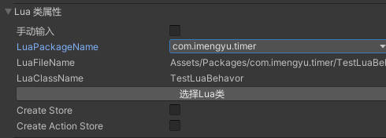
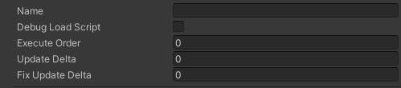
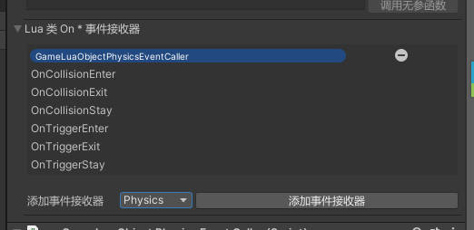

# LUA 类的帮助

## 定义

游戏框架提供了Lua面向对象编程的方法，可以与 Unity MonoBehavior 无缝衔接，这个是lua类的定义。

```lua
-- 这个是lua类的定义

---自定义Lua类，通常配合 GameLuaObjectHostClass 使用。
---@class MyClass : GameLuaObjectHostClass --如果该类被 GameLuaObjectHost 使用, 则它会继承 GameLuaObjectHostClass 类，你可以直接调用相关方法
MyClass = ClassicObject:extend()

--暴露方法给 GameLuaObjectHost
function CreateClass:MyClass()
  return MyClass()
end

--New 函数
function MyClass:new()
  --Do someting
end

---成员函数
function 类名:MyFunction(arg)
end
function 类名:MyFunction2()
end

--[[
如果该类被 GameLuaObjectHost 使用或在 GamePackage 中直接调用 RegisterLuaObject 注册了一个 Lua 对象时，此类可以写MonoBehaviour中的Start、Awake、Update、OnGUI等等和On*函数，具体请参考 下面 Lua MonoBehavior 的说明。
--]]
function MyClass:Start()
  --Do someting
end
```

## Lua MonoBehavior

GameLuaObjectHost 是一个让 Lua 可以与 Unity MonoBehavior 无缝衔接的组件，可以让你的Lua代码获取MonoBehavior一样的开发体验和能力。

你可以在自己的游戏对象上添加 GameLuaObjectHost 组件：


然后设置当前类所控制的lua脚本：




具体脚本你可以参考示例文件 `Assets\Packages\com.imengyu.timer\TestLuaBehavor.lua` ，这个类为你展示了如何使用 GameLuaObjectHostClass 和 Lua 类, 他的作用是每帧旋转当前对象，下面为你说明基本使用方法：

```lua
--这里导入了Unity的一些定义
local Vector3 = UnityEngine.Vector3
local Time = UnityEngine.Time
--这里导入了Ballance2框架的一些定义
local Log = Ballance2.Log

---测试Lua类
---这个类为你展示了如何使用 GameLuaObjectHostClass 和 Lua 类
---@class TestLuaBehavor : GameLuaObjectHostClass
TestLuaBehavor = ClassicObject:extend()

--暴露方法给 GameLuaObjectHost 创建当前类
function CreateClass:TestLuaBehavor()
  return TestLuaBehavor()
end

--New 函数
function TestLuaBehavor:new()
  --new 中是当前类创建的时候调用
  --你可以在这里初始化一些变量
  self.speed = 3
end

---start 函数，与 MonoBehavior Start 一样
function TestLuaBehavor:Start()
  Log.D('Test', "Start!")

  --使用 self.gameObject 可以访问当前游戏对象
  Log.D('Test', self.gameObject)

  --使用 self.transform 可以访问当前变换对象
  Log.D('Test', self.transform)
end
---Update，与 MonoBehavior Update 一样
--但是注意，lua 中不建议在update中执行大量操作，会产生大量跨语言调用和GC，非常影响性能。
--Update 的调用频率可以在 GameLuaObjectHostClass 中设置 UpdateDelta 来限制，UpdateDelta设置多少就表示每隔几帧调用一次。
function TestLuaBehavor:Update()
  --调用API旋转当前物体
  self.transform:RotateAround(Vector3.up, self.speed * Time.deltaTime)
end
```

### 配置属性



* Name 可以为空，作用是在 模组包中使用 FindLuaObject API 和 名字 可以快速找到当前游戏对象。
* DebugLoadScript 已弃用，目前没有用。
* ExecuteOrder 脚本执行顺序，越大越靠后，不能小于0 。
* UpdateDelta 设置Lua的Update函数调用频率。UpdateDelta设置多少就表示每隔几帧调用一次。
* FixUpdateDelta 设置Lua的FixUpdate函数调用频率。FixUpdateDelta设置多少就表示每隔几帧调用一次。

### 添加参数

有些时候，你会想，在编辑器中可以设置这个类的属性，就像在C#中一样，公开一个Public变量，然后在编辑器中就可以编辑了。

Lua要实现这个比较麻烦，不过 GameLuaObjectHostClass 还是花了力气提供了参数功能，虽然不能和C#中一模一样，但实现基本功能是没问题了。你可以在 Lua Intaial Vars 中添加你的公共参数：


然后在代码中你就可以使用 `self.MyVar` 来访问你在编辑器中设置的变量了。

如果要有代码提示功能，需要手动在当前类上添加下定义：

```lua
---测试类
---@class TestLuaBehavor : GameLuaObjectHostClass
---@field MyVar GameObject 添加了一个变量，类型是 GameObject 可以用 self.MyVar 访问
TestLuaBehavor = ClassicObject:extend()
```

修改 Type 可以修改当前变量的类型。

#### 比较特殊的类型 Component Class

这是一个非常有用的类型，你可以获取某个游戏的对象的某个组件，然后直接到Lua中使用，省去了手动 GetComponent 。

例如，这里我设置了一个MyVar, 并获取了游戏对象上的 Camera 组件：


然后就可以在Lua代码中直接调用 Camera 相关函数：

```lua
---测试类
---@class TestLuaBehavor : GameLuaObjectHostClass
---@field MyVar Camera 添加了一个变量，类型是 Camera
TestLuaBehavor = ClassicObject:extend()

function TestLuaBehavor:Start() 
  --可以直接调用相关方法和属性
  self.MyVar.fieldOfView = 100
  --调用方法
  self.MyVar:WorldToScreenPoint(Vector3(0,0,0))
end
```

#### 更新

注意，在运行时，参数在你手动修改后不会自动更新到Lua，你需要手动按 “UpdateToLua” 按扭把参数更新到Lua。或者也可以手动按 “UpdateFromLua” 把Lua修改的参数显示到编辑器中。或者在Lua代码中调用 UpdateVarsToLua 函数。

### 添加附加事件

默认情况下，也是为了性能， GameLuaObjectHostClass 只会向lua调用 Start、Awake、Update、OnGUI 这几个事件，如果你需要其他事件，例如 OnTriggerEnter，你需要向当前 GameLuaObjectHostClass 添加事件发射器.

事件发射器按类型做了分类，你可以选择需要添加的分类然后添加，
下方会显示当前事件发射器会发送的事件。



添加后，你只需要在Lua代码中加入函数定义，就可以接受到事件了：

```lua
---当进入触发器事件
---@param collisionInfo Collider
function TestLuaBehavor:OnTriggerEnter(collisionInfo) 
  --处理你自己的逻辑
end
```

### 其他

如果你觉得少了什么，欢迎提Issue
