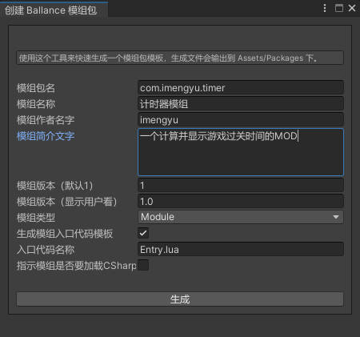
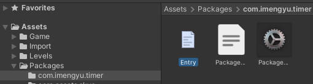

# 自定义模组开发教程

## 准备

* Unity 2021.2.1 以上版本
* Visual Studio Code
* 克隆本项目 https://github.com/imengyu/Ballance 至您的本地，使用Unity打开

## 知识储备

* lua 代码编写
* Unity 基础知识
* VSCode 调试

## 步骤

1. 点击 “主菜单” > “Ballance” > “模组开发” > “生成模块包模板”。

    

2. 在弹出窗口中输入你的模组基本信息

    

    * 包名：是你的模组唯一ID
    * 名称：模组显示给玩家看的名称
    * 类型：
        * Module 表名这是一个模组包，包含代码
        * Asset 表名这是一个资源包，不包含代码
    * 生成模组入口代码模板：勾选的话会为你生成一个入口模板代码。
    * 加载CSharp：表示你的模组是否需要使用动态加载C# DLL来实现模组功能。不推荐，C#写比较麻烦，而且不能在IL2Cpp 模式加载，推荐用lua。

3. 点击生成，然后你可以在 Packages 目录下找到为你生成的模组包模板。

    

    这个文件的功能是：

    * Entry.lua 入口模板代码, 你的模组代码将从这里开始执行。
    * PackageDef.xml 你的模组配置文件，在这里可以修改模组的名称、配置等等。
    * PackageLogo.png 你的模组 Logo，显示在模组管理器中。

4. 测试模组

    模组支持在Unity中直接加载调试。先试试你刚刚生成的模组吧。

    你需要先运行游戏，然后在模组管理器中启用你的模组。

    

    点击保存，然后游戏会关闭，你需要手动重新运行下。

    第二次运行，你会看到，控制台中输出了 “这是模块入口！” 这一句，这一句就是写在你的模组入口代码中的打印语句，这就说明，属于你的代码，成功的运行进入了游戏中！

    

    下面，你就可以，使用这个代码，来进行你的模组开发了。

5. 例子

    还是以计时器为例子，todo。。。

6. API 参考文档

    [查看 API 参考文档](../LuaApi/readme.md)。

7. 打包模块

    * 选择主菜单 “Ballance”>“模块开发”>“打包模块包”

      

    * 选择你的模组，然后平台选择：
      * 如果是 Win 版本，只需要选择 Standalone Windows 即可。
      * 如果是 android 版本，需要选择 Android。
      * 如果是 ios 版本，需要选择 iOS

      注意：Win/android/ios版本不能混用，会无法加载。

    * 可以选择打包至 DebugFolder，文件会输出至 `项目目录/Debug/Packages` 下。
    * 成功后你就可以在输出目录中找到后缀为 ballance 的文件了，这就是您的模组，你可以把它复制放在 `游戏目录\Ballance_Data\Packages` 文件夹下，打开游戏，在模组管理器中可以找到你的模组，需要先启用，然后重启游戏，即可看到模组效果。

    
