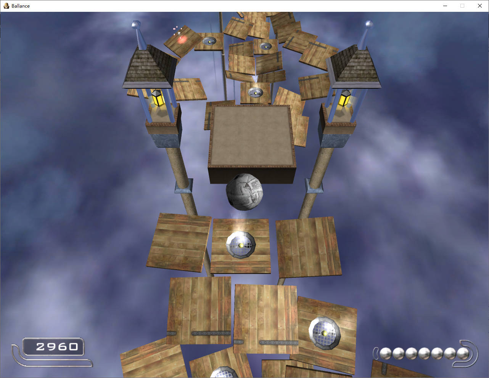
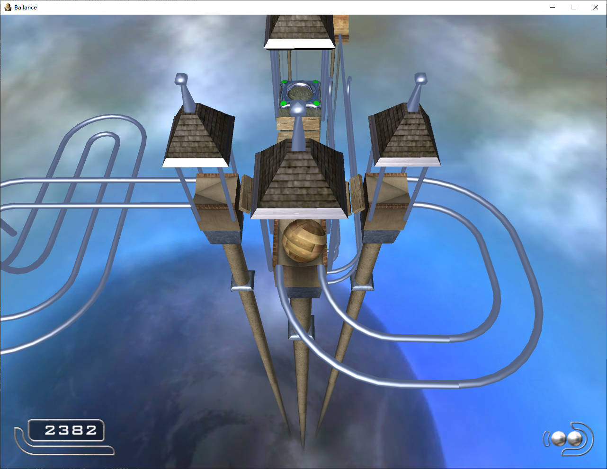
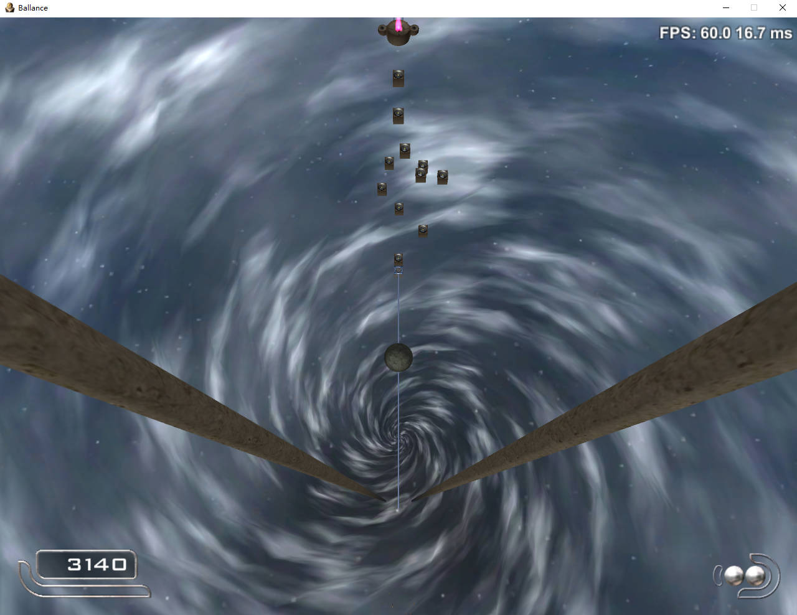
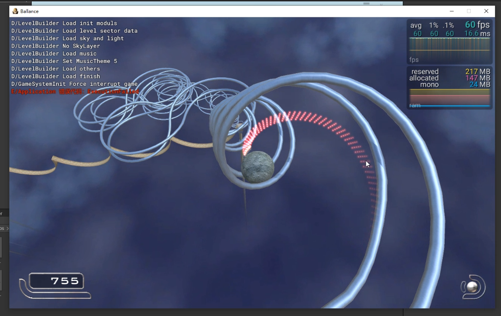
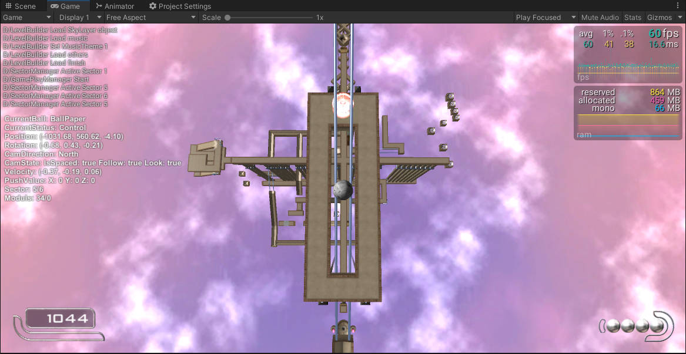
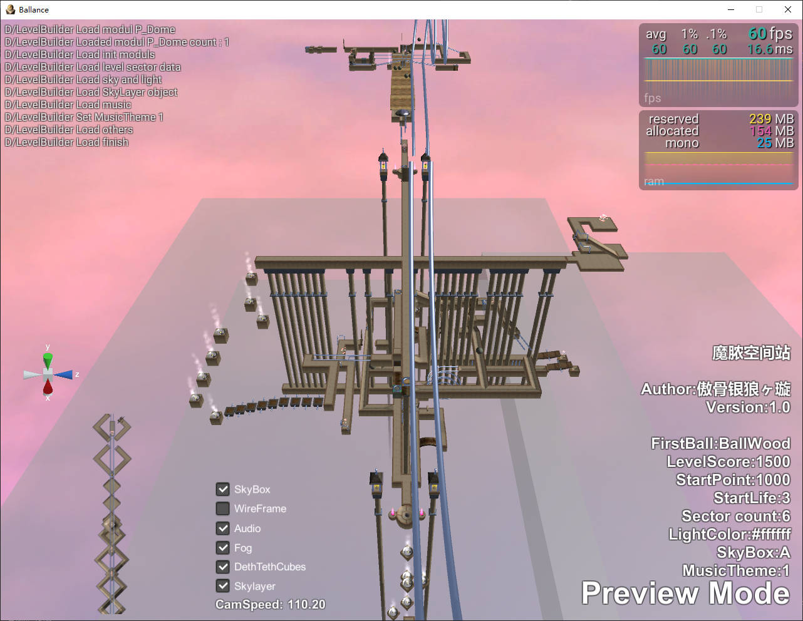

# Ballance

[Chinese Readmre](./README.md)

## Introduction

This is an open source unity remake version of ballance game.

---

## Features

* Original game content
* Level 1-13
* Custom level (魔脓空间站 as an example)
* Level previewer
* Mod manager
* **Using Lua to make custom mod**

## Document

[Full Document](https://imengyu.github.io/Ballance/#/readme)

[API documentation](https://imengyu.github.io/Ballance/#/LuaApi/readme)

## System requirements

Minimum requirements

* Windows 7+
* MacOS High Sierra 10.13+ (Intel)
* Android 6.0+

||Minimum|Recommended|
|---|---|---|
|Processor|Quad core 3Ghz+|Dual core 3Ghz+|
|Memory|1 GB RAM|2 GB RAM|
|Graphics card|DirectX 10.1 capable GPU with 512 MB VRAM - GeForce GTX 260, Radeon HD 4850 or Intel HD Graphics 5500|DirectX 11 capable GPU with 2 GB VRAM - GeForce GTX 750 Ti, Radeon R7 360|
|DirectX|11|11|
|Storage space|60 MB free space|100 MB free space|

## Installation steps

1. Goto [Releases](https://github.com/imengyu/Ballance/releases) find the latest version.
2. Download the corresponding zip installation package.
3. Unzip all files, then run `ballance.exe` to start the game.

## Turn on debugging mode

When running in unity editor, it is always debug mode.

### If you need to turn on the debugging mode of standalone version, you can

1. Go to the about menu, click the version number several times until the prompt pops up.
2. Then restart the game, you enter the debugging mode.
3. You can press F12 to open the console.

In the debugging mode, you can press the Q key to raise the ball and the e key to lower the ball.

Enter the `quit dev` command on the console to turn off the debugging mode.

### Open all original levels

After entering the debugging mode, you can enter `highscore open-all` command in the console to open all levels.

### How to run project source code

You need:

* Install Unity 2021.2.3+
* Install a code editor (VScode or Visual Studio)
* Clone or download this project `https://github.com/imengyu/Ballance` to your computer.

Steps:

1. Open the project with unity.
2. When running for the first time, you need to click the menu "Slua > All > Make" to generate Lua interface files. After generation, you don't need generate again.
3. Open `Scenes/MainScene.unity` scene.
4. Select the `GameEntry` object, set `Debug Type` to `NoDebug` in the inspector.
5. Click Run and you can see the game.

## Game album

Original levels

Level 13

Self made level (魔脓空间站)

Level previewer

