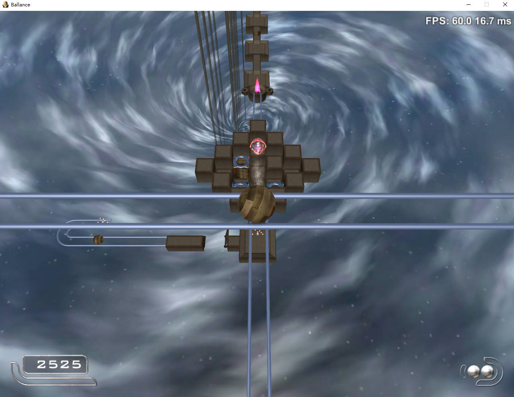
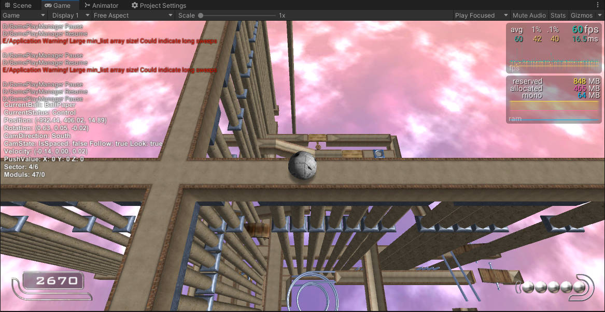

# 
Ballance Unity Rebuild

  <a href="README.CN.md">简体中文</a> | English

  
  
  
  
  

---

## Introduction

This is an open source unity remake of ballance game

**Note: Ballance belongs to Cyparade's work, and the copyright belongs to the original developer Cyparade. The development of this project is for learning purposes only and cannot be used for any commercial purposes. This project follows the GPL-3.0 protocol, but is limited to the code of this project. Any 3D model data, physical engine, images, audio and video, and game data related to Ballance are not within this scope. Any use of these game data for commercial activities without the permission of the copyright owner is illegal.**

The project has completed the features of the original version:

* Original game content
* Level 1-13 game content
* Physical effect similarity 85%

Compared with the original version, this project has added the following features:

* **Load NMO files directly** (Windows version only)
* Android version, Mac version (You can also try to compile other platforms)
* Self made map interface
* Modul interface (Use C# to develop mod or custom modules)
* Level previewer
* Mod manager

## System requirements

Minimum requirements

* Windows 7+
* MacOS High Sierra 10.13+ (Intel)
* Android 6.0+

||Minimum|Recommended|
|---|---|---|
|Processor|Quad core 3Ghz+|Dual core 3Ghz+|
|Memory|1 GB RAM|2 GB RAM|
|Graphics card|DirectX 10.1 capable GPU with 512 MB VRAM - GeForce GTX 260, Radeon HD 4850 or Intel HD Graphics 5500|DirectX 11 capable GPU with 2 GB VRAM - GeForce GTX 750 Ti, Radeon R7 360|
|DirectX|11|11|
|Storage space|60 MB free space|100 MB free space|

## Installation steps

* Windows:

1. Goto [Releases](https://github.com/imengyu/Ballance/releases) find the latest version.
2. Download the zip installation package in assets.
3. Unzip all files, then run `Ballance.exe` to start the game.

* MacOS：

  To be completed

* Android：

  To be completed

* iOS:

  To be completed

## Keys and gameplay

* The PC version operation remains unchanged from the original game. You can modify the key mapping in the Settings>Control menu.
* The mobile version has added a touch keyboard, and you can modify the keyboard style in the Settings>Control menu.

## Turn on debugging mode

In debugging mode, the ball can fly and you can use it to cheat or test levels.

1. Go to the about menu, click the version number several times until the prompt pops up.
2. Then restart the game, you enter the debugging mode.
3. You can press F12 to open the console.

In the debugging mode, you can press the Q key to raise the ball and the e key to lower the ball.

Enter the `quit dev` command on the console to turn off the debugging mode.

### Open all original levels

After entering the debugging mode, you can enter `highscore open-all` command in the console to open all levels.

## Directly load NMO file [new]

Ballance Unity Rebuild Version 0.9.8 supports the function of loading the original level file of ballance.

You can load a standard original ballance NMO level by clicking start > NMO level.

The core uses the Virtools SDK 5.0 to process NMO files, so only the windows 32-bit version is supported.

Most levels can be loaded successfully and played, but there are a few restrictions:

* Cannot load level with Virtools script.
* Point and line mesh of Virtools are not supported.
* The material does not support the special effect of Virtools. The default material will be used instead.

### How to run project source code

You need:

* Install Unity 2021.3.2+
* Install a code editor (VScode or Visual Studio)
* Clone or download this project `https://github.com/imengyu/Ballance` to your computer.

Steps:

1. Open the project with unity.
2. Open `Scenes/MainScene.unity` scene.
3. Select the `GameEntry` object, set `Debug Type` to `NoDebug` in the inspector.
4. Click Run and you can see the game.

## Generate game programs from project source code

Please refer [production document](wiki/production.md)。

## Physics Engine

The C++source code for the physics engine can be found [here](https://github.com/nillerusr/source-physics) (this is not the author's own repo).

The wrapper DLL code for the physics engine is located in the BallancePhysics directory below the project, and you need to compile it using Visual Studio 2919 or higher.

## Project progress and roadmap

The original gameplay and level reproduction have all been completed, and you can fully experience the game from start to finish. You can also refer to the development interface to create custom levels. The author will continue to develop based on everyone's feedback in the next step, adding more features, such as fun moduls, level editors, and so on.

## Contribute

If you have any good modifications or problem solvers, welcome PR. If you have any good ideas or comments, or if you find a bug, please feel free to submit an issue.

## Why did i do this?

Ballance Unity is a small dream of the me, I hoping to enable Ballance to run on mobile phones and easier make the levels and mods (the latter has been [BallanceModLoader](https://github.com/Gamepiaynmo/BallanceModLoader) Implemented). Also, Ballance Unity was my first project to learn about Unity game development, which greatly helped me improve my skills.

## Game album

Original levels

Level 13

Self made level (魔脓空间站)

Level previewer

## Open source projects used in the project

* https://github.com/chrisnolet/QuickOutline
* https://github.com/seedov/AsyncAwaitUtil/
* https://github.com/Tayx94/graphy
* https://github.com/yasirkula/UnityRuntimeSceneGizmo
* https://github.com/yasirkula/UnityRuntimeInspector
* https://github.com/yasirkula/UnitySimpleFileBrowser
