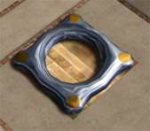
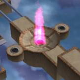
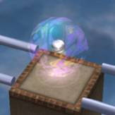
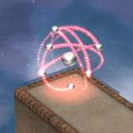

# Ballance 玩法

这部分内容来自于原版的帮助手册，欢迎访问Ballance Wiki [https://ballance.jxpxxzj.cn](https://ballance.jxpxxzj.cn) 查看更多游戏教程，Ballance的历史等等，这是关于Ballance最完整的知识库。

欢迎访问[Ballance吧](https://tieba.baidu.com/ballance)与广大游戏爱好者一起讨论游戏。

## 介绍

Ballance是一款基于关卡的技能游戏，玩家可以在迷宫般的路径和轨道上移动球。比赛的目的是在不丢球的情况下达到每一关的终点。

如果你成功地完成了一个关卡，下面的关卡将被永久解锁。所有解锁的关卡可以随时重新游玩。（暂时没有其他保存选项）

## 移动球和视图

**移动球：**

你用键盘导航球，使用箭头键 “前进”、“后退”、“向左”和“向右”。您可以随时在“设置/控制” 菜单中重新配置键盘设置。

**视图：**

箭头键“左键”和“left”还有第二个功能。

如果按住 <kbd>左Shift</kbd> 键，可以使用 “左/右” 箭头键将视图旋转90度。

推荐你经常使用这个功能以获得更好的视角方向！！！

如果旋转方向与预期不符，可以在“选项/控制”菜单中反转旋转方向。

使用 <kbd>空格键</kbd>，还可以提升视角高度。

## 变球器

在你通过关卡的路上，你会遇到所谓的“变球器”，你可以用它改变球的材质。

石头变球器将球变为石头球，将木头变球器变为木球，依此类推。

每种材料都有一种变球器。

变球器类型可以通过放置变球器的现场材料来识别。右边的变球器（图）显然是一个木制变球器。

根据材料的不同，球的物理特性也会发生变化。

## 检查点

在你的旅程中，你必须通过每个关卡的几个检查点。

如果你失去了一条生命（例如，跌入无底深渊），你将回到最后一个检查点并从这里继续（只要你还有至少一条生命）。

## 额外生命球

游戏开始时你有3条额外的生命。

界面右下角的银色小球数量显示了剩余寿命。

通过拾取额外生命球，你可以增加一条额外的生命。

如果你从赛道上掉下来，没有更多的生命，你将不得不从头开始重放这个关卡。

如果你在某个小节死亡并重新开始，所有这个小节额外的生命将再次出现（不同于额外的分数球）。

## 额外分数球

游戏开始时你有1000个时间点，这些时间点以每秒2点的速度持续减少。你越快达到一个关卡的终点，你剩下的分数就越多，你的分数也就越高。

屏幕左下角会显示实际的时间点数量。

通过增加一个点，你的时间点分数增加220点。

每一个额外的分数只能获得一次，当你在某个小节死亡并重新开始时，已经获取的额外分数球不会再次显示。

提示：在你通过检查站之前，收集所有追逐你的的银色小球。否则，在你获得额外分数之前，他们将消失。
