# 关卡帮助

**一般提示:**

* 使用 <kbd>ESC</kbd> 可以进入暂停菜单。从这里你可以访问所有游戏设置。您可以退出或重新开始关卡。
* 总是试着俯瞰地形并分析情况。频繁旋转视图并频繁使用概览键（默认值：<kbd>空格</kbd>）。

使用从侧面视角状态下从一个平台跳到另一个平台会更容易。

* 如果你设法让自己陷入绝望的境地，你可能不得不跳出跑道自杀。

与现实生活不同的是，一段关卡会在你跌落死亡后重置（除了已经收集的额外点数）。

* 额外时间球只能收集一次。
* 额外生命球会在死亡后重新出现。

**每个关卡的提示和解决方案：**

“小节”是指两个检查点之间的关卡部分。每个关卡至少由5个小节（和4个检查点）组成。

## Level 1

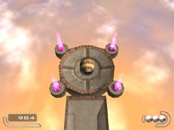

如果你已经完成了教程（要一直到最后！）这个关卡应该没有任何问题。

要记得经常转动你的视角。

**提示：**
在这个关卡中，有一个隐藏的额外时间球！

## Level 2

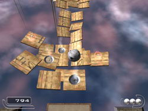

技能关卡！在这里接受一些训练！

谁害怕风扇？

乘坐在风扇上，然后等待 (!) 直到你到达最高点。不用着急！！！

（空气可以让你上升，但不会把你推离气流。）

在（温暖的）气流上漂浮时，慢慢转动相机。

最好在侧视视角时跳跃，这样可以获得正确的跳跃距离。

## Level 3

**第02节：**

全速前进！

滚下钢轨加速到全速。然后，在跳完后，在拐角处滚到下一个斜坡。（其实很简单）。

为了得到额外的分数，你必须跳得更远！要做到这一点，你必须在跳跃的瞬间反转推力的方向。如图所示侧向转动相机，以获得更好的控制。

**第03节：**

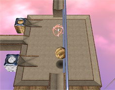

现在出现了“侧轨”，你只需同时按住两个转向键。在本例（图）中，按住“前进”和“向右”。

纸球要小心！如果你跑得太快，它可能会跳出跑道。在这种情况下，木球是更好的选择。

顺便说一句一旦你将球稳定在侧栏上，你可以轻松地停下来或转身，只要你仍然按住特定的侧推键。

抓住这个机会练习。因为更危险的护栏即将出现……

## Level 4

**第03节：**

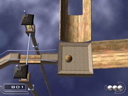

谜语：

先想想！不要跳得太快，否则你就再也起不来了！

建造一座石球桥。

你需要多少个石球来填补这个空白？

提示：

你可以更容易地一个接一个地推石头球！

**第04节：**

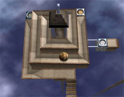

有时你必须走捷径，但在哪一边？

石球对于吊桥来说太重了，风扇有时会成为障碍。

**第05节：**

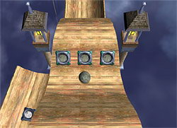

这是个比较难解的关卡！（不过不需要太多技能）

没完没了地来回摆动是没有用的。

你需要正确的策略！

唯一不能被石质变球器抓住的球是……一个石头球！

**解决方案：**

> 你必须成为一个石头球才能战胜一排石质变球器。 
一个石球有足够的速度爬上斜坡，只要你从顶部开始，**并且不释放前进**！ 
在其中一个“波浪”上使用变球器切换到一个石球（图中未显示）。然后全速驶向出口（只需继续按前进键），避免路上遇到木质变球器。只要你从顶部开始，**并且不释放前进**，石球就可以轻松地在所有波浪上滚动！ 
最后一个斜坡和前一个一样容易克服，没有变球器会抓住你……

## Level 5

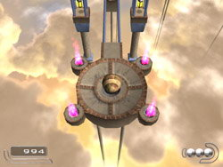

这个关卡也不会造成任何问题。

在第一小节，不要迷失你的方向。

沉重的木箱更容易用强大的石球推动。

## Level 6

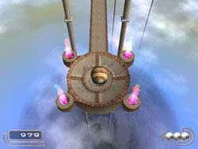

使用你的技能过这一关！

这个关卡没有很难的谜题。

## Level 7

**第01节：**!

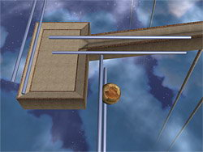

对胆小的猫没什么！

这种侧轨组合需要同时按下两个键。以最大推力在轨道之间切换。

其实很简单：只要继续向前和向左按压，直到你到达平台。（如果有帮助，你可以闭上眼睛5秒钟。）

更可怕的是，更加可怕的使用即将到来。。。哈哈哈。。。

**第03节：**

明智地选择正确的变球器。

有时，如果你从一开始就没有选择好合适的球，你可能不得不后退一点。

**第05节：**

你知道怎么做！

有时东西会被一堆箱子藏起来。

解决方案：

> 首先，在小平台上用石球往下跳。然后小心地滚上旋转栅门，让我们把箱子推下去，这样就可以看到一个风扇。然后朝相反的方向转动旋转推板，以推下木桥。 
在你完成这两件事之后（之前别跳），跳到纸上变球器，体验转变的喜悦。 
浮到平台上，穿过桥梁，再次浮到所需的长轨道上，你就走出了这个迷宫。 

## Level 8

**第02节：**

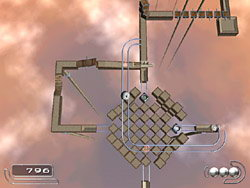

这里有一个迷宫也需要一些技巧。

把木球滚到立方体中间，然后左转。翻过吊桥并将栅栏门推到一边。

然后回到立方体，朝石头变球器走去，继续前进，把所有的箱子推离轨道。

然后往回走，最后进入纸变球器（图中的右侧），一直浮到栏杆上，直到你落在石头变球器后面。

作为一个纸球，你可以轻松地通过“斜方块”离开这一部分。

**第03 a节：**

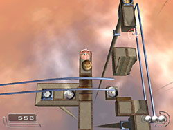

往下然后经过它。

（像木球一样）从小桥跳到纸变球器上。

作为一个纸球，你漂浮在风扇上，在栏杆下（但在木桥上方）跳到另一个风扇上。

从这一步开始，跳到小平台上，将侧栏杆移到另一侧（额外分数点的位置）。

在这里，你可以使用木质变球器。然后，你再次进入侧栏，但让它们走到一半，以推下木桥。

你在可以桥上滚动球，现在可以跳转至钢轨上并滚动球离开这个阶段。

**第03 b节：**

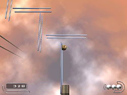

请看 Level 7 第01节。

**第05节：**

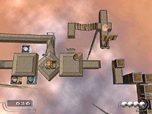

你必须穿过秋千几次，先是木球，然后是石球，最后是纸球（并且总是回来进行转换）。

第一次推下T型桥，第二次推下木箱，作为一个纸球，你终于可以离开这个区域了。

建议：只要安全，就利用这个机会练习秋千。

## Level 9

**第01节：**

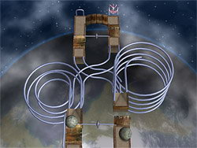

比赛

如果你以很快的速度走这些螺旋轨道，你就不会掉下来。

为此，请顺时针快速按导航键。这就是一个正确时机的问题！

如果你改变推力方向太早（或太迟），你就无法达到必要的加速度。

试着在左边的石头球落下之前到达底部。

如果你速度非常快，您可以拾取额外的时间点。

**第05 a节：**

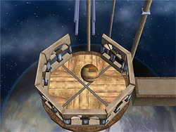

升降机

检查周围环境。

你不必推倒所有的墙。有时你可能升得太高了！

**第05 b节：**

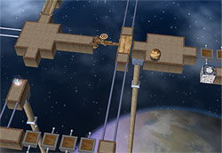

隐藏变球器（图中右侧）。

## Level 10

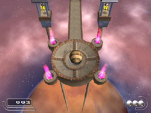

如果你一路达到这个关卡，你不应该在这里遇到任何严重的障碍。

## Level 11

**第01节：**

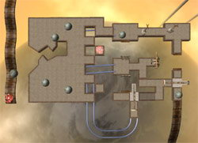

如果你把石球推到较低的平台上会发生什么？

解决方案：

> 首先把一个石球推到栏杆上（如下图所示）。它会将栅栏门推到一边。 
然后，你自己从中间跳过轨道，推下两座桥（左、右），一直往前走到T桥，你也向下推。 
然后，（而不是更早）你跳下台阶，把另一个栅栏门推到一边。 
然后你可以通过第一个栅栏门一直向上滚动。然后你穿过两个通过摆动摆的沙袋，把石球推到一边，全速跑下木制坡道（图右下角）。 

**第02 a节：**

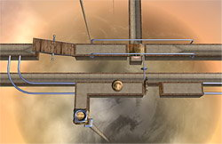

这里有个谜语！

升高你的视角以获得更好的概览！

解决方案：
> 你被迫绕圈而行。关键是在正确的位置掉头。 
切换到一个木球，然后逆时针在双翼桥上滚动（根据图片：先在下侧，然后在上侧）。然后你穿过跷跷板，小心地把它往下推。 
然后再从2翼桥的下侧走一遍，然后转身。现在顺时针在跷跷板上走，最后你就能从洞里跳下去了。双翼桥的上部现已打开。 

**第02 b节：**

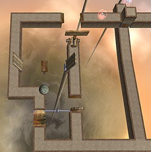

这里有个谜语！

注意不要切断自己的后路。

解决方案：
> 首先在左边（双翼桥上方），向下推一个木桥。然后你回到双翼桥右侧并推倒它。剩下的是显而易见的。 
别忘了把“落石”下面的木箱推开。小心不要把自己推到另一边，否则你就不会回来了。

**第04节：**

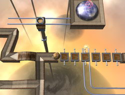

为了通过这一部分，你迟早要变成一个纸球（最好以后）

提示：有时你不得不冒着跳远的风险。。。

图片：

为了到达轨道（下图中的底部），在浮板块上快速滚动。你至少可以通过3个浮板。你从栏杆上的第三个和第四个浮板之间落下了。

在你去纸质变球器的路上拿起额外的生命球。

**第05节：**

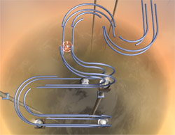

这个轨道结是“普通”轨道和侧轨的组合。

这是一个在正确的时间改变立场的问题。

慢慢来。也许你想站着不动一会儿，即使是挂在扶手上（不过要一直按合适的按钮）。

试着摸索到你必须改变方向的时刻。

速度不是这次成功的关键！！！！

**第06节：**

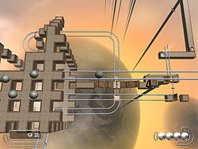

博格方块谜语

花点时间检查所有东西，不要跳得太快！

在立方体的中间，有一个长的轨道（顶部）可以用来获得整个场景的概览。

解决方案：

> 你需要推倒两个石球。第一个将栅栏门（向下）推到一边。第二个应该是向下推双翼桥（在图片的右侧）。 
然后你小心地滚（跳）下台阶（拾取额外的时间点），然后跳下栏杆。你一直走到两个跷跷板前，把右边的一个翻过来（看这张照片），然后把木箱往下推。 
然后你回去，把第二个跷跷板朝着立方体的中间滚动。在立方体的另一侧，你可以找到（并使用）纸变球器。在那之后，你一路回到两个跷跷板上，拾取额外的时间点跳进洞里，然后。。。就这样。 
剩下的很简单。。 

## Level 12

**第02节：**

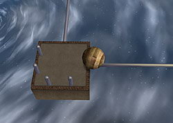

关于单轨（即单轨）的一般建议：

不要试图在没有帮助的情况下进入单轨。

寻找可以作为指导的物体。

这对杆子（图中）就是为了这个目的而放在那里的。

在2个杆子之间推动球，直到球稳定（平静）。然后朝相反的方向滚动。

永远不要尝试在单轨上转向（右或左）！！！

小心使用导致单轨的弯曲轨道：

转弯时不要走得太快，否则你在下面的单轨上就找不到你需要的方向了。

**第03 a节：**

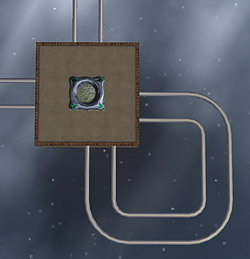

重述第2节中的内容！

普通导轨实际上就是两个相邻的单轨 :)

解决方案：

> 这个小循环并不像看上去那么无用。它可以作为在对面轨道上滚动的指南！ 
只要穿过平台，不做任何转向尝试，球就会像在单轨上一样在轨道的一侧滚动。 
通过这种方式，你也可以回过头来获得你刚刚经过的额外分数球。

**第03 b节：**

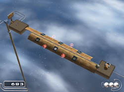

这也是对你操控能力的挑战。

解决方案：
> 你从左边以一个石球的形式进入这个阶段，开始变成木头。然后你小心地在木管上滚动，并向下推石球。 
如果你想收集点额外的时间点，可以移动到纸变球器，改变球的材质，并收集所有额外的时间点。 
回去换回木头。 
尽量到达管道的另一边，尽量避开石头变球器。 
你不能推下t型桥！ 
剩下的很简单！在两根杆子之间保持稳定，一直回到单轨上，直到到达另一个平台的石变球器（第3 a节）。换成石头，再回到T型桥，你现在可以很容易地把它推倒。

**第04节：**

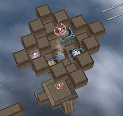

耐心点，这一部分应该不会有问题。

小贴士：石球或木球，你也可以从风扇中落下。有时候这是最好的方法。

**第07节：**

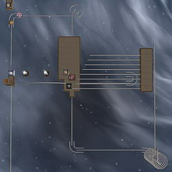

非常困难和复杂的谜语，但不需要太多技巧！

尝试俯瞰，并尝试应用你所学到的关于单轨的所有知识。

解决方案：
> 首先到中间的大平台，转换成石头。稳定在最顶端的杆子上，全速滚动到地板间隙的另一侧。全速前进，你不会摔倒！继续在单轨上滚动（不需要走太远转向）。向上移动，收集所有额外的东西。 
接下来，你在2个杆子之间保持稳定，从顶部开始在第五个单轨上滚动，它似乎指向你下方的木质变球器。避开木质变球器往下跳，然后在单轨上向后滚动（不要向右或向左转向）到U形转弯。穿过它，在另一条平行的单轨上向后滚动，朝向平台。 
你现在正处于长弯单轨的正中央。带着动力朝着它前进。翻过弯曲的单轨桥（再次无转向），在另一侧向下推下所有木箱。但要小心——稍微刹车，以免从另一边掉下来。 
剩下的很简单：换成纸球。再次浮到大平台上。换成木球，从你可能从这来的单轨离开。 
现在全速驶向出口，跳过纸变球器（不要转向），离开另一侧单轨平台。

**第08节：**

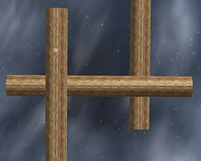

你就快要成功了。这是最后一次考验，也是一次艰难的考验：

你必须变成石球在木管上滚动！这是唯一的办法！

速度不是关键！在你继续前进之前，花点时间在管道上保持平衡。

总是先在第一根管子的末端拾取额外的生命。那是你的生命保险。

你能做到的！！！！
