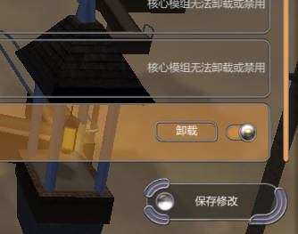
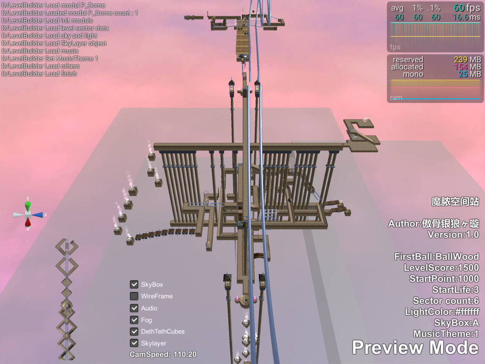

# Ballance Rebuild 游戏教程

欢迎访问Ballance Wiki [https://ballance.jxpxxzj.cn](https://ballance.jxpxxzj.cn) 查看游戏教程，Ballance的历史等等，这是关于Ballance最完整的知识库。

本重制版仅仅是作者为爱而做的个人自制项目，与官方没有任何关系，官方很早就解散了，Ballance原版只有1.13版本。

本文档将带你了解下Ballance重制版的基本教程。

## 安装

安装很简单，你只需要解压 Zip，然后双击 “Ballance.exe” 即可开始游戏！

## 游玩

本重制版与原版玩法基本一致，应该不需要我说明了吧，点击 主菜单 “开始” 选择，关卡即可开始游戏。

默认按键下，可以使用：

* 上下左右键移动球
* 按住 <kbd>Shift</kbd> 再按 左或者右键 可以旋转摄像机
* 按 <kbd>Space</kbd> 空格键可以升起俯视

## 安装自定义关卡

文件后缀为 .ballance 是重制版关卡文件，你可以把它放在 `游戏目录\Ballance_Data\Levels` 文件夹下，打开游戏，在开始中选择 “自定义关卡” 菜单，即可加载自定义关卡。

## 安装自定义模组

文件后缀为 .ballance 是重制版模组文件，你可以把它放在 `游戏目录\Ballance_Data\Packages` 文件夹下，打开游戏，在开始中选择 “设置” > “模组管理器” 菜单中启用你的模组，然后保存修改重启游戏，模组即可使用。

## 制作自定义关卡或者自定义模组

请参考文档：

* [制作自定义关卡文档](../LevelMaking/readme.md)
* [制作自定义模组文档](../SystemModding/readme.md)

## 增加的功能

### 关卡预览器

重制版提供了内置的关卡预览器，你可以使用它来预览关卡。

* 点击主菜单 “开始” “自定义关卡”
* 在其中选择你要预览的关卡，在下方点击 “预览此关卡”，即可进入预览

在关卡预览器中：

* 按住鼠标左键拖动视图
* 鼠标中键放大缩小
* 按住鼠标右键旋转视图
* 按住鼠标右键然后按
  * 按 <kbd>W</kbd> 可以前进
  * 按 <kbd>A</kbd> 可以向左
  * 按 <kbd>S</kbd> 可以向后
  * 按 <kbd>D</kbd> 可以向右
  * 按 <kbd>Q</kbd> 可以降低
  * 按 <kbd>E</kbd> 可以升高
* 按住鼠标右键然后滚轮可以调整相机移动速度

### 游戏其他小功能

* 按 <kbd>F10</kbd> 可以显示FPS
* 按 <kbd>F9</kbd> 截图，截图默认保存至 `C:\Users\[你的用户名]\AppData\LocalLow\imengyu\Ballance\ScreenShot`  文件夹下。
* 按 <kbd>F8</kbd> 可以切换UI显示/隐藏, 方便截图时截出不带UI的图片

### 调试工具

游戏提供了一些调试方法，可以让你制作地图或者关卡时可以方便的调试，参考[一些调试方法](debug-tools.md)。

## 错误反馈/意见建议/新功能请求

如果游戏崩溃，或者遇到了bug，请在GitHub发起一个Issue，并提供以下信息：

* 请详细描述你遇到的情况；
* 请加上发生错误的日志文件 `Player.log`（放在 `C:\Users\[你的用户名]\AppData\LocalLow\imengyu\Ballance` 文件夹下）。
* 附上错误或者bug发生的相关截图；

如果你有什么建议或者新功能请求，也可以提Issue。

如果你想一起开发，可以联系我，或者向我提交 Pull Request, 我会非常重视。
