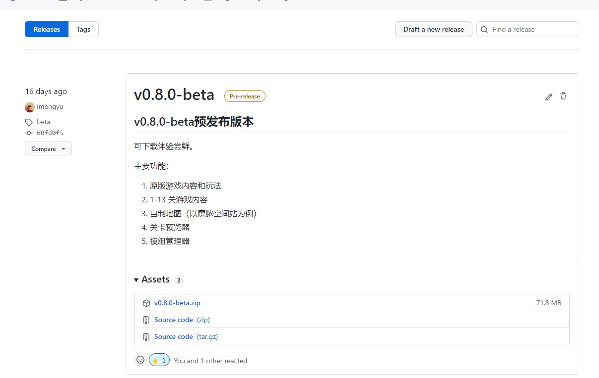
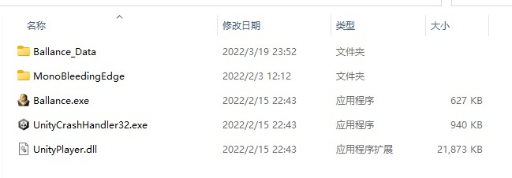

# 教程

Ballance Rebuild 是滚球 Ballance 游戏的开源 Unity 重制版，由 [快乐的梦鱼](https://imengyu.top) 制作。

这个重制版复刻了原版90%的内容，并且使用了新的架构，增加了许多新的功能，你可以非常轻松的制作自定义模组或者地图，并且，新游戏适配新电脑，你可以在Windows7-11的新系统上运行，不会出现奇奇怪怪的兼容性问题。

你可以游玩这个重制版，还可以根据此重制版制作自定义模组或者地图，分享给其他玩家游玩。

项目的源代码存放在 [https://github.com/imengyu/Ballance](https://github.com/imengyu/Ballance) 你可以克隆至你的本地后开发。

## 系统要求

||最低配置|推荐配置|
|---|---|---|
|操作系统|Windows 7-11|Windows 7-11|
|处理器|Dual core 3Ghz+|Quad core 3Ghz+|
|内存|1 GB RAM|2 GB RAM|
|显卡|DirectX 10.1 capable GPU with 512 MB VRAM - GeForce GTX 260, Radeon HD 4850 or Intel HD Graphics 5500|DirectX 11 capable GPU with 2 GB VRAM - GeForce GTX 750 Ti, Radeon R7 360|
|DirectX 版本|11|11|
|存储空间|100 MB 可用空间|200 MB 可用空间|

## 安装

本重制版是对原作的复刻，并不依赖于原作，你可以在不安装原版的情况下运行。

安装步骤

1. 你可以在项目[源代码仓库](https://github.com/imengyu/Ballance/) 寻找最新的 release
    
2. 在 releases 的 Assets 下找到附带发行的zip发行包
3. 解压至任意一个目录
    
4. 双击 `Ballance.exe`
5. 开始游戏

## 快速开始

在进入游戏后你可以转到“设置/视频” 菜单，将屏幕分辨率提高到与您的显示屏匹配的选项，也可以在这里切换游戏的全屏模式。

随后您可以返回主菜单，点击“开始”按钮，选择关卡，开始您的游戏。

我们强烈建议在第一关开始时玩完整的教程（游戏介绍）。

在玩游戏时，您可以随时使用 <kbd>ESC</kbd> 键暂停游戏，还可以更改任何设置（例如音乐音量）。

开始时，只有第一关是可选的。如果你成功地完成了一个关卡，下面的关卡将被永久解锁。

如果你在某个时候遇到了困难，你可能需要查看级别帮助以获得提示。

祝你玩得高兴！

## 更多内容

[Ballance wiki](https://ballance.jxpxxzj.cn/wiki/) 是由 [Ballance吧](https://tieba.baidu.com/ballance) 游戏爱好者创建的 Ballance 游戏知识库，
您可以访问学习到关于这个游戏的更多知识，也可访问[Ballance吧](https://tieba.baidu.com/ballance)与广大游戏爱好者一起讨论游戏。
