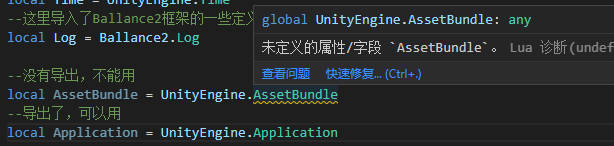

# API总览

这是 Lua 开发 API 参考文档。

在进行开发之前，推荐您阅读相关Demo和示例，并参考API文档。

如果遇到问题或者文档不全有错误等，欢迎提出 Issue！

## Unity 公开的 API

框架向Lua提供了很多 Unity 的 API，你可以按需使用。

Unity API 特别多，这里不做说明了，你可以参考[Unity 官方API文档](https://docs.unity3d.com/Manual/index.html)。

使用方法是，在你的代码前面加入声明，然后就可以使用了：

```lua
--导入Unity的定义
local Vector3 = UnityEngine.Vector3

--这样就可以使用了
local vector3Instance = Vector3(1,0,0)
```

注意：因为性能的问题，不是全部的 API 都导出到 Lua 可以用。

要知道 API 是不是可以用，可以试一试写定义，



如果没有这个定义，说明它没有导出到Lua，不能用。

如果你急需这个API，欢迎向我提出Issue，我会把它加进去。

## Ballance C#框架API

框架向Lua提供了很多的 API，你可以按需使用。

[完整文档参考](./cs-api/readme.md)。

```lua
--导入Unity的定义
local Log = Ballance.Log

--这样就可以使用了
Log.D('Test', 'Hello world!')
```

本框架的 API 全部都有详细的说明文档，只要你生成了Lua代码提示文件并且正确配置，API都有详细的代码提示。具体参考[环境配置](../SystemModding/readme.md#环境配置)。


## Lua 类

框架提供了 Lua 面向对象的组件，和 Lua 的 MonoBehavior，你可以使用这些组件来开发。

具体参考[LUA 类的帮助](../SystemModding/lua-class.md).

## Ballance Lua API

这一部分是游戏Lua部分专用的API, C#端是无法访问的。

[完整文档参考](./game-api/readme.md)。
