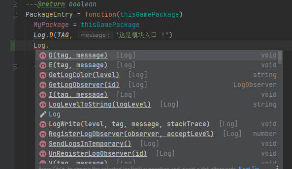
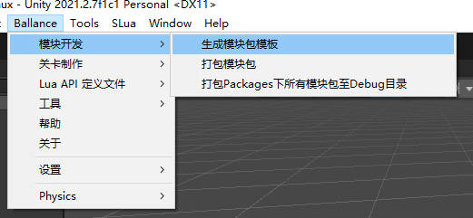
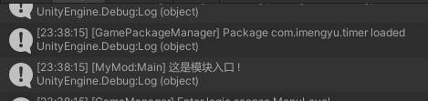
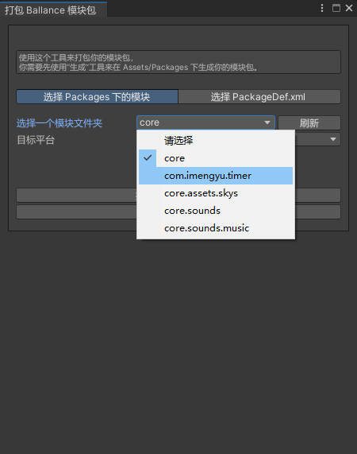

# 自定义模组开发教程

## 准备

* Unity 2021.2.1 以上版本
* Visual Studio Code
* 克隆本项目 https://github.com/imengyu/Ballance 至您的本地，使用Unity打开

## 知识储备

* lua 代码编写
* Unity 基础知识
* VSCode 调试

## 环境配置

* 第一次运行需要生成Lua相关文件，否则Lua代码将无法正常工作，点击菜单“SLua”>“All”>“Make”即可自动生成，后续可不用生成。
* 然后你可以生成Lua的API代码提示文件，方便你后续的模组代码编写：

  * 打开 `Assets\System\Scripts\Editor\Lua\SLuaApiExporter.cs` ，修改 `unityDocPath` 成你自己的 Unity 安装目录。
  * 然后点击菜单“Ballance”>“Lua API 定义文件”>“生成所有”。

  这以后，程序会在 `Assets\System\Scripts\LuaHelpers\LuaDefineApi` 目录下生成Lua代码提示文件，你可以把它添加到你的Lua编辑器引用文件夹中，
  这样，在你编写代码时，就可以有非常方便的代码提示了。

  * VScode （需要安装Lua插件，打开项目后，插件会自动扫描提示文件，无须配置）

    

  * IDEA （需要安装emmylua插件）

    你需要在 emmylua 插件中添加外置文件目录，将 LuaDefineApi 路径加进去：

    

    然后你的Lua代码就拥有提示功能了：

    

## 模组制作步骤

1. 点击 “主菜单” > “Ballance” > “模组开发” > “生成模块包模板”。

    

2. 在弹出窗口中输入你的模组基本信息

    

    * 包名：是你的模组唯一ID
    * 名称：模组显示给玩家看的名称
    * 类型：
        * Module 表名这是一个模组包，包含代码
        * Asset 表名这是一个资源包，不包含代码
    * 生成模组入口代码模板：勾选的话会为你生成一个入口模板代码。
    * 加载CSharp：表示你的模组是否需要使用动态加载C# DLL来实现模组功能。不推荐，C#写比较麻烦，而且不能在IL2Cpp 模式加载，推荐用lua。

3. 点击生成，然后你可以在 Packages 目录下找到为你生成的模组包模板。

    

    这个文件的功能是：

    * Entry.lua 入口模板代码, 你的模组代码将从这里开始执行。
    * PackageDef.xml 你的模组配置文件，在这里可以修改模组的名称、配置等等。
    * PackageLogo.png 你的模组 Logo，显示在模组管理器中。

4. 测试模组

    模组支持在Unity中直接加载调试。先试试你刚刚生成的模组吧。

    你需要先[运行游戏](../Help/readme.md#在编辑器里运行)，然后在模组管理器中启用你的模组。

    

    点击保存，然后游戏会关闭，你需要手动重新运行下。

    第二次运行，你会看到，控制台中输出了 “这是模块入口！” 这一句，这一句就是写在你的模组入口代码中的打印语句，这就说明，属于你的代码，成功的运行进入了游戏中！

    

    下面你就可以，使用这个代码，来进行你的模组开发了。

5. 完整模组例子

    Ballance 模组可能有这几种功能，我为你提供了几个详细的例子，你可以参考他们开发：

    * 为游戏添加功能性的修改（以计时器为例子，制作一个计算并显示过关时间的MOD）[具体的开发请参考文档](timer-demo/readme.md)。
    * 为Ballance游戏添加自定义机关（以弹射器为例子，制作一个可把球弹射出去的机关）[具体的开发请参考文档](ejector-demo/readme.md)。
    * 为Ballance游戏添加自定义球（以弹弹球例子，制作一个高弹性的弹球）[具体的开发请参考文档](bouncing-ball-demo/readme.md)。

    游戏提供了一些调试方法，可以让你制作地图或者关卡时可以方便的调试，参考[一些调试方法](../Help/debug-tools.md)。

6. 调试 Lua 代码

    重制版提供了两种Lua调试插件：

    * vscode-debuggee
    * mobdebug

    要开启调试，你需要进入 MainScense ，然后选择 GameEntry 对象，
    在调试配置中勾选 DebugEnableLuaDebugger，然后选择 DebugLuaDebugger 为指定调试器，然后运行游戏，你就可以使用调试器连接游戏进行调试了

    

    以vscode-debuggee为例：

    1. 你需要在VScode先安装vscode-debuggee插件，你可以使用它进行调试。
    2. 项目自带了vscode-debuggee调试模式，你只需要选择模式，然后先在VScode中运行

        

    3. 会弹出等待调试器窗口，然后回到Unity，点击播放。
    4. 然后调试器就会在你之前设置的断点停下，你可以查看变量，进行调试等等。

        

7. API 参考文档

    具体关于Lua可用的API, 你可以[查看 API 参考文档](../LuaApi/readme.md)。

8. 打包模块

    在你的模组开发测试基本没问题后，你就可以准备打包了，打包后即可在游戏中加载，然后你就可以分享给其他玩家。

    * 选择主菜单 “Ballance”>“模块开发”>“打包模块包”

      

    * 选择你的模组，然后平台选择：
      * 如果是 Win 版本，只需要选择 Standalone Windows 即可。
      * 如果是 android 版本，需要选择 Android。
      * 如果是 ios 版本，需要选择 iOS

      注意：Win/android/ios版本不能混用，会无法加载。

    * 可以选择打包至 DebugFolder，文件会输出至 `项目目录/Debug/Packages` 下。
    * 成功后你就可以在输出目录中找到后缀为 ballance 的文件了，这就是您的模组，你可以把它复制放在 `游戏目录\Ballance_Data\Packages` 文件夹下，打开游戏，在模组管理器中可以找到你的模组，需要先启用，然后重启游戏，即可看到模组效果。

    
