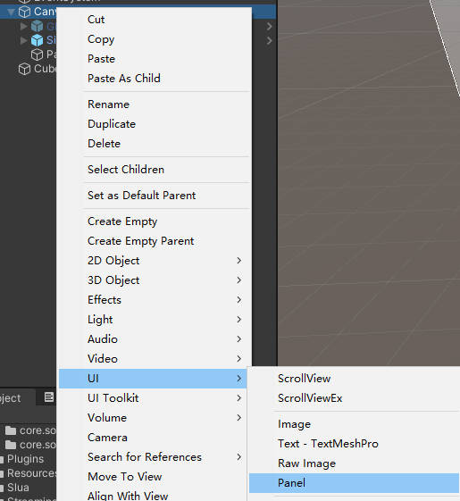
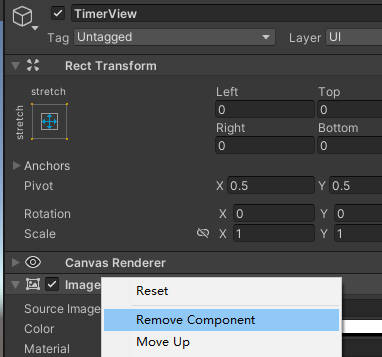
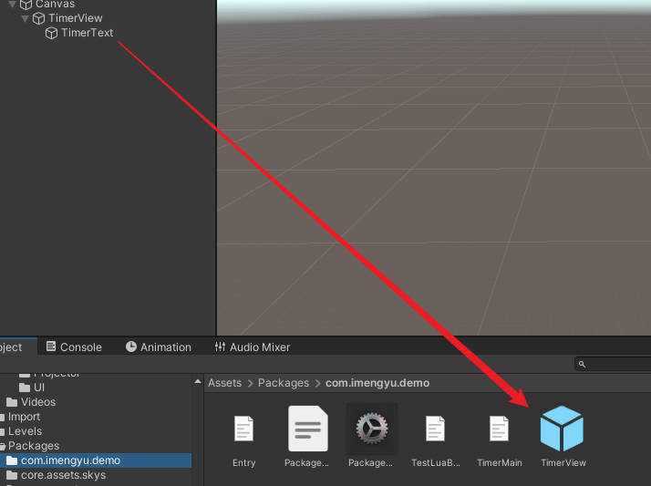
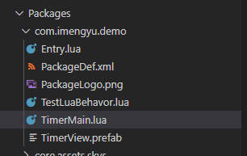
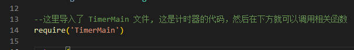
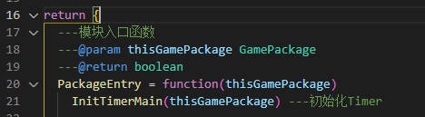
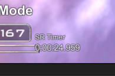

# 功能性模组-计时器例子

以计时器为例子，制作一个计算并显示过关时间的MOD

这个MOD非常简单，他的功能是，计算玩家从开始游戏至过关消耗了多少时间。你可以通过这个简单的MOD示例来了解如何制作你自己的MOD。

这个Demo的源码位于项目 `Assets/Packages/com.imengyu.demo/TimerMain.lua`，你可以打开查看。

## 准备

你需要做一些准备，并生成代码模板，具体，你可以参考[自定义模组开发教程](../readme.md)中的详细步骤（1-3步）。

## 步骤

### 构思

第一步当然是要知道模组需要完成什么功能，功能要在什么地方，什么样子展现。

这个MOD的功能是，计算玩家从开始游戏至过关消耗了多少时间。

就是说，在玩家开始关卡时，开始计时, 并实时显示时间，玩家过关后，停止计时，显示过关时间。

所以，模组需要做的有：

* 监听游戏开始和停止等等事件，开始/停止计时
* 需要一个UI显示过关时间

下面这个教程将教您如何实现这个模组。

### 设计制作UI

1. 首先，需要在任意一个场景中创建一个 Panel，这个 Panel 将作为你的UI容器。

    

2. 移除这个 Panel 默认自带的白底 Image 组件（不然你的UI会是白色背景的）。

    

3. 在 Panel 下添加一个 Text（文本） 组件, 修改这两个组件名称为易于理解的名字，这里改成了 “TimerView” 和 “TimerText”。

    

4. 把文本组件移动到合适的位置，设置他的字体，颜色，文字大小等等为合适的效果，并设置他的停靠锚点。

    

5. 随后，你可以将你的UI组件（图中是“TimerView”）拖动到你的模组目录中，Unity 会自动创建一个预制体（Prefab），这以后，你可以直接双击打开这个预制体（Prefab），直接在预制体中编辑修改，无须在场景中添加再修改，非常方便。

    

这样你就成功创建了自己的UI组件，之后，你就可以在模组代码中将其添加至游戏中了。

### 编写启动代码

在参考[自定义模组开发教程](../readme.md)中的详细步骤后，你应该生成了一个模组模板代码，`Entry.lua` 就是你的模组入口代码，一切初始化流程都需要从这里开始。

下面来编写模组的启动代码。

1. 在模组目录下创建一个计时器功能的脚本文件TimerMain.lua

    

    在这个文件添加一个入口函数：

    ```lua
    ---@param thisGamePackage GamePackage
    function InitTimerMain(thisGamePackage)
    end
    ```

    强烈推荐你把单独模块的代码分成单独的文件，不要一股脑写在 Entry.lua 中，特别是当你的模组会有很多个功能时。分成单独的模块文件会让你后续编写维护更加清晰。

2. 在 `Entry.lua` 中引入这个文件

    

3. 然后就可以在 PackageEntry 入口函数中调用 `InitTimerMain` 入口函数了。

    

### 编写主功能代码

经过上一步，你已经建好了模块的脚本文件TimerMain.lua，下面向他添加功能吧。

第一步我们分析，这个MOD的功能是计算玩家从开始游戏至过关消耗了多少时间。
因此，它需要在关卡开始时执行功能，关卡退出时，模组也要退出（毕竟在主菜单里面不需要计时）。

依据游戏的[事件系统](../events.md)，我们可以侦听 EVENT_LEVEL_BUILDER_START、EVENT_LEVEL_BUILDER_UNLOAD_START 这两个事件，分别是关卡开始加载，关卡开始卸载事件。

```lua
Game.Mediator:RegisterEventHandler(thisGamePackage, 'EVENT_LEVEL_BUILDER_START', 'TimerMainHandler', function (evtName, params)
  ---关卡开始加载
  return false
end)
Game.Mediator:RegisterEventHandler(thisGamePackage, 'EVENT_LEVEL_BUILDER_UNLOAD_START', 'TimerMainHandler', function (evtName, params)
  ---关卡开始卸载事件
  return false
end)
```

在关卡开始时可以创建并显示我们的UI：

```lua
--在初始化的时候，添加我们在编辑器中预制的Prefab
TimerView = GameUIManager:InitViewToCanvas(thisGamePackage:GetPrefabAsset('TimerView.prefab'), 'GameTimerView', false)
--获取View中的Text组件，稍后显示时间要用
TimerText = TimerView:Find('TimerText'):GetComponent(Text)
```

关卡卸载时移除UI：

```lua
--关卡卸载时，需要移除我们添加的UI
if not Slua.IsNull(TimerView) then
  UnityEngine.Object.Destroy(TimerView.gameObject)
  TimerText = nil
  TimerView = nil
end
```

然后，可以构建计时器相关的代码了，分别是计时和显示，
这里使用了 GameTimeMachine 更新控制器注册了Update函数（因为这个脚本没有绑定到GameLuaObjectHost，没有 Update 函数），以实现每帧的回调更新。

更新函数分为两个部分，一个部分是计时的，另一部分更新函数是用于更新Text的，因为Text不需要每帧更新，不然消耗较大。

```lua
--这两个变量用来存储更新函数句柄，用于后续取消
local UpdateTick = nil
local UpdateTick2 = nil
--这个变量是玩家过关时间
local TimeValue = 0

local CreateTimer = function () --创建定时器
  --计时部分
  UpdateTick = GameTimeMachine:RegisterUpdate(function ()
    TimeValue = TimeValue + Time.deltaTime --增加当前帧时间
  end, 0, 0) 
  --更新Text部分
  UpdateTick2 = GameTimeMachine:RegisterUpdate(function ()
    --这里还需要把秒转换下，变成时分秒格式
    local _, ms = math.modf(TimeValue)
    local seconds = math.fmod(TimeValue, 60)
    local min = math.floor(TimeValue / 60)
    local hour = math.floor(min/60) 
    --格式化然后设置到Text上
    TimerText.text = string.format('%d:%02d:%02d.%03d', hour, min, seconds, ms * 1000)
  end, 0, 10) --大约10帧更新一次Text
end
```

计时器开始后自然需要停止，不然会一直计时：

```lua
local StopTimer = function () --停止定时器
  --防止重复释放
  if UpdateTick ~= nil then
    UpdateTick:Unregister()
    UpdateTick = nil
  end
  if UpdateTick2 ~= nil then
    UpdateTick2:Unregister()
    UpdateTick2 = nil
  end
end
```

随后，你就发现，在游戏中有很多种状态，例如开始之前有一段时间球没有出生，玩家不能控制；死亡后到出生也有一段时间无法控制。这样，如果我们把计时器在 EVENT_LEVEL_BUILDER_START 事件中开始显然是不合适的，我们需要监听 [GamePlayManager](../../LuaApi/game-api/class/GamePlayManager.md) 中更详细的相关事件并开启或者停止计时器：

```lua
local GamePlayManager = GamePlay.GamePlayManager --获取GamePlayManager
--监听游戏开始事件
GamePlayManager.EventStart:On(function ()
  CreateTimer() --开始定时器
end)

--监听游戏暂停事件和下落/死亡事件，我们的计时器也需要停止计时
GamePlayManager.EventPause:On(function ()
  StopTimer()--停止定时器
end)
GamePlayManager.EventFall:On(function ()
  StopTimer()--停止定时器
end)
GamePlayManager.EventDeath:On(function ()
  StopTimer()--停止定时器
end)

--监听游戏继续事件, 继续时，我们的计时器也需要继续计时
GamePlayManager.EventResume:On(function ()
  CreateTimer() --开始定时器
end)

--监听游戏过关事件, 过关时，停止计时器
GamePlayManager.EventQuit:On(function ()
  StopTimer() --停止定时器
end)

--监听游戏退出事件, 退出时，停止计时器
GamePlayManager.EventQuit:On(function ()
  StopTimer() --停止定时器
end)
```

至此，我们的模组基本功能就实现了。

### 调试

参考[自定义模组开发教程](../readme.md)中的详细步骤4。

### 成果

最终，我们制作了一个可以显示过关时间的模组：

